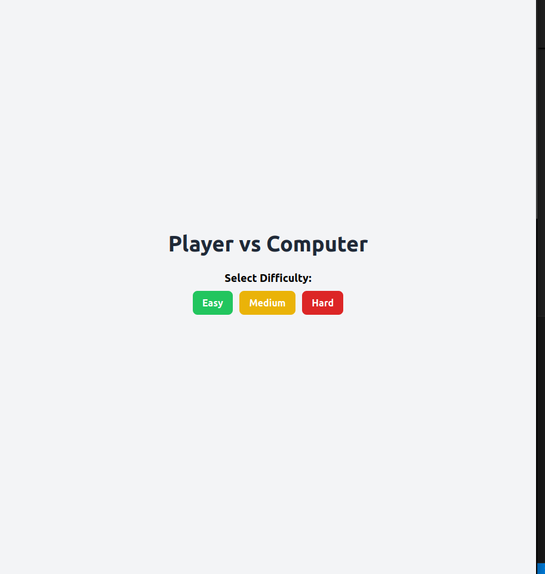
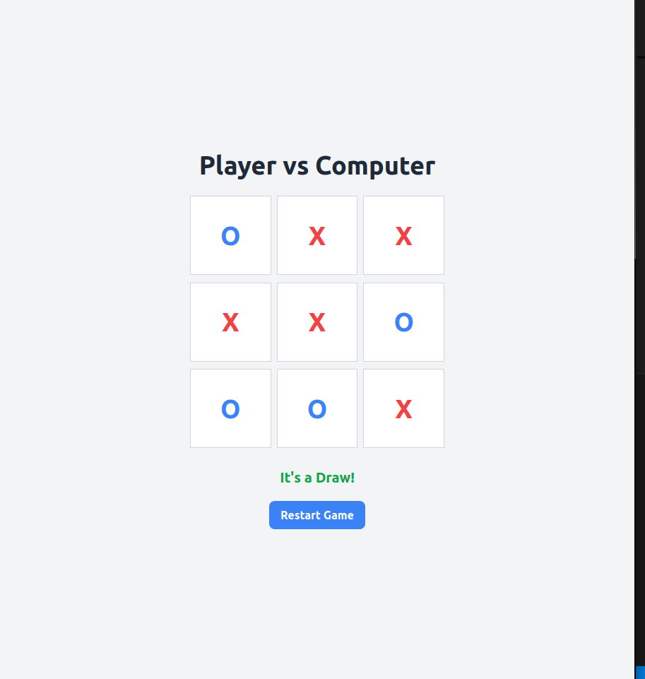
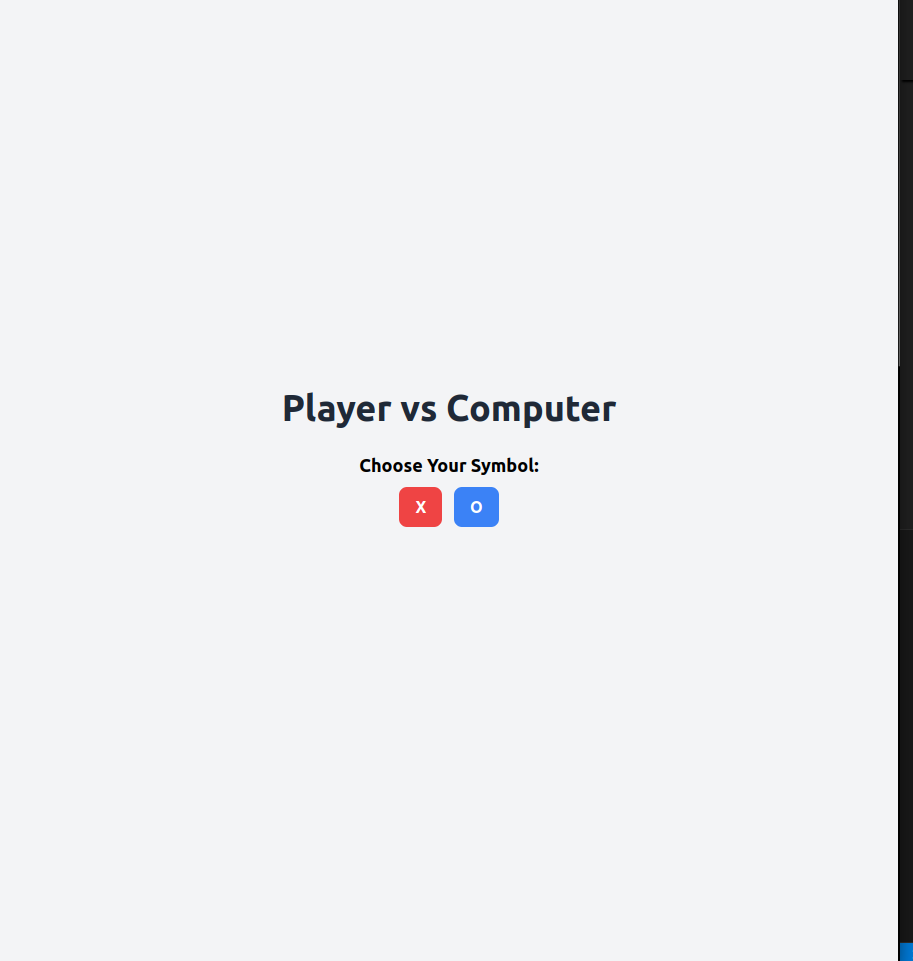

# 🧠 Tic-Tac-Toe Game Collection

This repository includes two versions of the classic Tic-Tac-Toe game:

- 🎮 **Terminal-Based Game** – A simple command-line version where you play against an AI.
- 🌐 **WebApp-Based Game** – A Flask-powered web version with an interactive interface, deployable on Render.

---

## 🗂 Project Structure

```

tic-tac-toe/
├── README.md
├── terminal-game/
│   └── tic_tac_toe.py              # Command-line game
└── tic_tac_toe_webapp/
  ├── app.py                        # Flask backend
  ├── logic.py                      # Game logic for webapp
  ├── requirements.txt
  ├── __pycache__
  | └── logic.cpython-310.pyc
  ├── static/
  │   └── screenshots               # Styling
  ├── templates/
  │   └── index.html                # HTML frontend

````

---

## 🎮 Terminal Game

**Directory**: `terminal-game/`

### How to Run:
```bash
cd terminal-game
python3 tic_tac_toe.py
````

* No third-party libraries needed — just Python 3.
* Basic AI logic included for single-player gameplay.

---

## 🌐 WebApp Game

**Directory**: `tic_tac_toe_webapp/`

### Live Demo:

[🔗 View Deployed App on Render](https://your-app-name.onrender.com) 

### How to Run Locally:

```bash
cd tic_tac_toe_webapp
pip install flask
python app.py
```

### Structure Overview:

* `app.py` – Handles HTTP routes and game state
* `logic.py` – Contains game logic (board management, win checks, AI moves)
* `templates/index.html` – The HTML UI of the game
* `static/style.css` – Styling for the web interface

---

## 🚀 Deployment on Render

This repository is configured so that **only the `tic_tac_toe_webapp/` folder** is deployed.

### Render Configuration:

* **Root Directory**: `tic_tac_toe_webapp`
* **Build Command**:

  ```bash
  pip install flask
  ```
* **Start Command**:

  ```bash
  python app.py
  ```

### Optional: `requirements.txt`

Inside `tic_tac_toe_webapp/requirements.txt`:

```txt
flask
```

---

## 📌 Features

* ✅ Play vs. basic AI (terminal and web)
* ✅ Interactive browser UI
* ✅ Clean project structure
* ✅ Flask-powered backend
* ✅ Deployable on Render.com

---

## 🖼 Screenshot





---

## 📄 License

This project is open-source and licensed under the [MIT License](LICENSE).

---

## 👨‍💻 Author

Created with 💻 and ❤️ by Md. Mehedi Hasan Rafy
